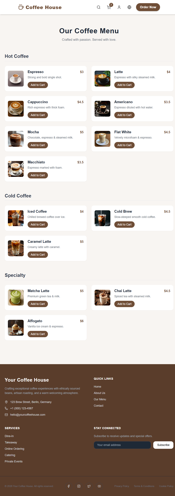

<p align="center">
  <strong style="font-size:2em;">☕ Coffee House – Full Stack Web Application</strong>
  <br>
  A modern full-stack coffee shop web app built with React, Node.js, Express, and PostgreSQL. Browse products, manage orders, and enjoy a responsive, user-friendly interface.
</p>

<p align="center">
  
  
  
  
  
  <a href="https://yourapp.vercel.app">
    
  </a>
</p>

---

## 📸 Preview

<p align="center">
  
  <br>
  <em>Home Page</em>
</p>

<p align="center">
  
  <br>
  <em>Menu Page</em>
</p>

<!-- <p align="center">
  
  <br>
  <em>Interactive Demo</em>
</p> -->

---

## 🚀 Features

- ☕ Browse coffee menu with detailed product info
- 🛒 Add items to cart and manage selections
- 👤 User authentication (planned)
- 📦 Order management system
- 🧾 Admin dashboard for product & order management (planned)
- 📱 Fully responsive design for all devices

---

## 🛠 Tech Stack

**Frontend:** React, JSX, HTML5, CSS3, JavaScript (ES6+)  
**Backend:** Node.js, Express.js  
**Database:** PostgreSQL (Cloud hosted via Supabase / Neon / Railway)

---

## ⚙️ Project Structure

coffee-house/
│
├── client/ # React frontend
│ ├── public/ # Static files
│ └── src/
│ ├── assets/ # Images, icons, fonts
│ ├── components/ # Reusable UI components
│ ├── pages/ # Page-level components
│ └── App.js # Main React app
│
├── server/ # Node.js backend
│ ├── controllers/ # Route controllers
│ ├── models/ # Database models
│ ├── routes/ # API routes
│ └── server.js # Entry point for backend
│
├── screenshots/ # Images and GIFs for README
├── README.md # Project documentation
└── package.json # Project metadata and dependencies

---

## ⚙️ Installation

```bash
# Clone repository
git clone https://github.com/yourusername/coffee-house.git
cd coffee-house

# Install frontend
cd client
npm install
npm start

# Install backend
cd ../server
npm install
npm run server

🌐 Deployment

Frontend: Vercel / Netlify
Backend: Render / Railway
Database: PostgreSQL Cloud (Supabase / Neon / Railway)

📈 Future Improvements

Payment gateway integration

Admin dashboard & analytics

Real-time order tracking

Full user account management

Product inventory management

👨‍💻 Author

Your Name
GitHub: https://github.com/yourusername

📄 License

This project is licensed under the MIT License.

```
