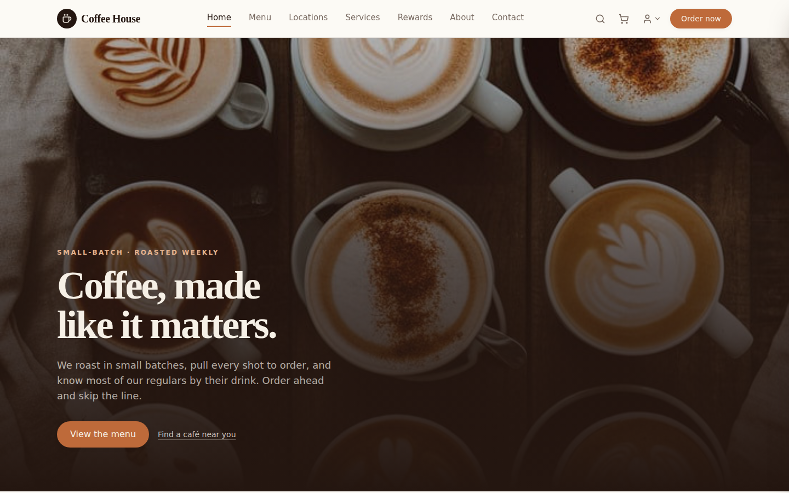
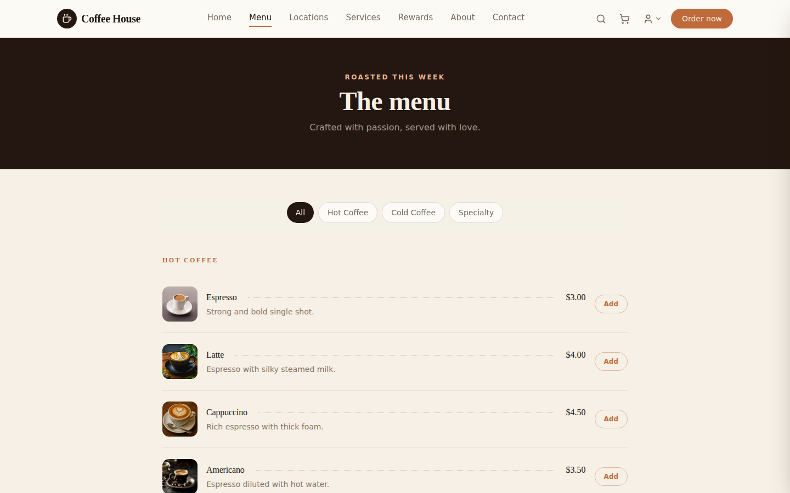

<p align="center">
  <strong style="font-size:2em;">☕ Coffee House – Full Stack Web Application</strong>
  <br>
  A modern full-stack coffee shop web app built with React, Node.js, Express, and PostgreSQL. Browse products, manage orders, and enjoy a responsive, user-friendly interface.
</p>

<p align="center">
  
  
  
  
  
  <a href="https://yourapp.vercel.app">
    
  </a>
</p>

---

## 📸 Preview

<p align="center">
  
  <br>
  <em>Home Page</em>
</p>

<p align="center">
  
  <br>
  <em>Menu Page</em>
</p>

<!-- <p align="center">
  
  <br>
  <em>Interactive Demo</em>
</p> -->

---

## 🚀 Features

- ☕ Browse coffee menu with detailed product info
- 🛒 Add items to cart and manage selections
- 👤 User authentication (planned)
- 📦 Order management system
- 🧾 Admin dashboard for product & order management (planned)
- 📱 Fully responsive design for all devices

---

## 🛠 Tech Stack

**Frontend:** React, JSX, HTML5, CSS3, JavaScript (ES6+)  
**Backend:** Node.js, Express.js  
**Database:** PostgreSQL (Cloud hosted via Supabase / Neon / Railway)

---

## ⚙️ Installation

### 1. Clone the repository
```bash
git clone https://github.com/yourusername/coffee-house.git
cd coffee-house
```

### 2. Set up PostgreSQL
Create a database (locally or with a hosted provider like Supabase, Neon, or Railway):
```sql
CREATE DATABASE coffeehouse;
```

### 3. Configure and start the backend
```bash
cd server
npm install
cp .env.example .env
# Edit .env and set DATABASE_URL to point at your Postgres database,
# and set JWT_SECRET to a long random string.

# Create the database tables
npm run migrate:deploy

# Seed a demo user (test@test.com / password) and the menu
npm run seed

# Start the API (http://localhost:5000)
npm start
```

### 4. Configure and start the frontend
In a new terminal:
```bash
cd client
npm install
cp .env.example .env
# By default VITE_API_URL points at http://localhost:5000/api

npm start
```

The app will be available at `http://localhost:5173`.

> **Tip:** if you'd rather apply the schema without the Prisma CLI, you can
> run the SQL directly: `psql "$DATABASE_URL" -f server/prisma/migrations/20260101000000_init/migration.sql`

## 💳 Payments

Checkout works out of the box in **sandbox mode** — no external account needed. Use these test cards on the checkout page:

- `4242 4242 4242 4242` → approved
- `4000 0000 0000 0002` → declined
- Any future expiry date (MM/YY) and any 3-digit CVC

No real card is ever charged in sandbox mode. To switch to real Stripe test-mode payments (a hosted Stripe Checkout page instead of the built-in form), create a free account at [stripe.com](https://dashboard.stripe.com/register), copy your **test** secret key from the dashboard, and add it to `server/.env`:
```
STRIPE_SECRET_KEY="sk_test_..."
```
The app automatically switches to live Stripe Checkout once this is set — no code changes needed.

---

## 🌐 Deployment

- **Frontend:** Vercel / Netlify
- **Backend:** Render / Railway
- **Database:** PostgreSQL Cloud (Supabase / Neon / Railway)

## 📈 Future Improvements

- Payment gateway integration
- Admin dashboard & analytics
- Real-time order tracking
- Full user account management
- Product inventory management

## 👨‍💻 Author

**Roshani Abeysekera**
GitHub: https://github.com/Roshani-Abeysekera

## 📄 License

This project is licensed under the MIT License.

